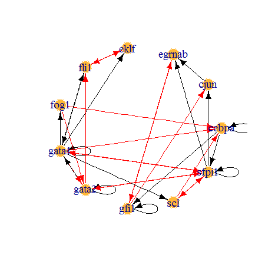
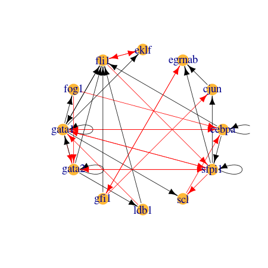

-   Brief introduction
-   Installation
-   Input data format
-   Output format
-   Useful functions in BTR
-   Example workflows
    -   Inferring model without an initial model
        -   Full workflow
        -   Initial setup
        -   Data preparation
        -   Run model training
    -   Inferring model with an initial model
        -   Full workflow
        -   Initial setup
        -   Data preparation
        -   Run model training
    -   Extending model with more genes
        -   Full workflow
        -   Initial setup
        -   Data preparation
        -   Add extra genes to the initial Boolean model
        -   Estimate initial state for the extra genes
        -   Run model training

<!---
    rmarkdown::pdf_document:
        toc: true
        number_sections: true
    rmarkdown::md_document:
        variant: markdown_github
        toc: true
-->
Brief introduction
==================

`BTR` is a model learning algorithm for reconstructing and training asynchronous Boolean models using single-cell expression data. Refer to the paper for more details on the concepts behind the algorithm. This vignette serves as a tutorial to demonstrate example workflows that can be adapted to individual cases experienced by users.

Running `BTR` is straightforward. However, note that depending on the (1) size of single-cell expression data and (2) complexity of Boolean model, `BTR` may take a long time to complete the computation. In such cases, it is advisable to use the built-in parallel processing capability of `BTR`. This can be easily achieved by using `doParallel` package, as illustrated in the example.

Note that the examples presented in this vignette are different from the results presented in our paper. The examples presented here have been simplified to speed up the processing time.

Installation
============

`BTR` can be installed from CRAN.

``` r
install.packages('BTR')
```

Or from Github for the latest version. To install from Gitbub, you will require the `devtools` package.

``` r
install.packages('devtools')
devtools::install_github("cheeyeelim/BTR")
```

Also install `doParallel` package if you intend to use parallel processing.

Input data format
=================

Depending on the analysis, only 3 types of data will ever be needed. The format of the data required is discussed below.

1.  Expression data. A matrix with genes on the columns, and cells on the row.

The expression data should be preprocessed as in any standard sequencing data processing pipelines, which includes quality control filtering and normalisation.

Use `initialise_raw_data` to convert expression data into a suitable format for model inference. It is recommended to use `initialise_raw_data` before subsetting the expression data for preferred cell types.

``` r
data(wilson_raw_data)
round(wilson_raw_data[1:5, 1:5], 4)
```

|           |     bptf|  cbfa2t3h|    csf1r|   dnmt3a|  eif2b1|
|-----------|--------:|---------:|--------:|--------:|-------:|
| lmpp\_002 |   1.0261|    2.3944|   2.6847|   1.6636|  2.0203|
| lmpp\_003 |   2.6496|    1.7800|   1.6821|   1.5941|  2.7736|
| lmpp\_004 |  10.3080|    0.5889|   4.2653|  -0.5565|  0.0026|
| lmpp\_007 |   0.5419|    1.8631|  10.8468|   0.1757|  1.0873|
| lmpp\_008 |   0.9209|    2.6637|   2.8549|   2.1965|  2.3663|

``` r
edata = initialise_raw_data(wilson_raw_data, max_expr='low') #max_expr='low' because this is qPCR data.
```

1.  Initial Boolean model. A data frame with two columns, targets and update functions.

Note that if an update function contains both activation and inhibition genes, they must be expressed with a separate clause containing only activation genes, and a separate clause containing only inhibition genes. (See the update functions of Gata1 and Gata2 for examples)

Use `initialise_model` to convert the input Boolean model into a BoolModel object.

``` r
data(krum_bmodel)
head(krum_bmodel)
```

| targets | factors                            |
|:--------|:-----------------------------------|
| gata2   | gata2 & ! ((gata1 & fog1) | sfpi1) |
| gata1   | (gata1 | gata2 | fli1) & ! sfpi1   |
| fog1    | gata1                              |
| eklf    | gata1 & ! fli1                     |
| fli1    | gata1 & ! eklf                     |
| scl     | gata1 & ! sfpi1                    |

``` r
bmodel = initialise_model(krum_bmodel)
```

1.  Initial state.

A single row data frame with genes as the columns. The expression state of each gene must be in binarised form, i.e. 0s and 1s.

Note that all the genes that are present in the initial Boolean model must also be present here.

``` r
data(krum_istate)
head(krum_istate)
```

|                |  cjun|  cebpa|  fli1|  gata1|  gata2|  eklf|  sfpi1|  gfi1|  scl|  egrnab|  fog1|
|----------------|-----:|------:|-----:|------:|------:|-----:|------:|-----:|----:|-------:|-----:|
| initial\_state |     0|      1|     0|      0|      1|     0|      1|     0|    0|       0|     0|

Output format
=============

BTR supports several output formats for Boolean models, as shown below.

-   `outgraph_model` - Outputs a Boolean model in a tab-delimited file with each line being an edge (i.e. gene interaction). This function also outputs a node attribute file, which can be used to distinguish gene and AND nodes in a graph plotting software. This format is readable by both Cytoscape and Gephi.
-   `outgenysis_model` - Outputs a Boolean model in a space-delimited file with each line being an edge (i.e. gene interaction). This format is readable by genYsis (used for steady state analysis).
-   `writeBM` - Outputs a Boolean model in a comma-delimited file similar in format to the input file format (i.e. two columns: genes and update functions).

BTR can also output a state transition graph.

-   `outstate_graph` - Outputs a state space of a Boolean model simulated with an initial state. This format is readable by both Cytoscape and Gephi.

Useful functions in BTR
=======================

Besides training Boolean models, BTR can be used for simulating a Boolean model asynchronously and calculate the score of a Boolean model with respect to a data.

-   `model_train` - Core function in `BTR` that performs Boolean model inference.
-   `simulate_model` - Simulate a Boolean model asynchronously using an initial state, and return its state space.
-   `calc_mscore` - Calculate a distance score for a Boolean model with respect to an expression data.
-   `model_dist` - Calculate the number of genes in the update functions that differ between two Boolean models.
-   `model_setdiff` - Show the genes in the update functions that differ between two Boolean models.

Example workflows
=================

Three example workflows will be discussed in this vignette: (1) Inferring model without an initial model, (2) Inferring model with an initial model, (3) Extending model with more genes. The two workflows are largely similar, which only differ in the data preparation step.

Inferring model without an initial model
----------------------------------------

This workflow is intended for use on inferring a Boolean model without an initial model.

When no initial model is used, BTR will reconstruct gene interactions from a list of user-specified genes. If the number of genes in the expression data is low (e.g. in qPCR), it is also possible to use all the genes in the expression data.

### Full workflow

Full workflow is included here for easy referencing. Each step is discussed in further details below.

``` r
set.seed(0)  #use to ensure reproducibility. remove in actual use.

# (1) Setup paths and environment.
library(BTR)

# If intending to use parallel processing, uncomment the following lines.
# library(doParallel) num_core = 4 #specify the number of cores to be used.
# doParallel::registerDoParallel(cores=num_core)

# (2) Load data.
data(wilson_raw_data)  #load a data frame of expression data.
cdata = initialise_raw_data(wilson_raw_data, max_expr = "low")

# (3) Filter cell types.
cell_ind = grepl("cmp", rownames(cdata)) | grepl("gmp", rownames(cdata)) | grepl("mep", 
    rownames(cdata))
fcdata = cdata[cell_ind, ]  #select only relevant cells.

# (4) Filter genes.
gene_ind = c("fli1", "gata1", "gata2", "gfi1", "scl", "sfpi1")  #select genes to be included.
fcdata = fcdata[, gene_ind]

# (5) Inferring Boolean model.
final_model = model_train(cdata = fcdata, max_varperrule = 3, verbose = T)

# (6) Visualise the Boolean model generated.
plotBM(final_model)
```

### Initial setup

The first step is to load the `BTR` package. If you are intending to use parallel processing, you will also need to load the `doParallel` package. Then specify how many cores you intend to use using `registerDoParallel` from the `doParallel` package.

``` r
set.seed(0)  #use to ensure reproducibility. remove in actual use.

# (1) Setup paths and environment.
library(BTR)

# If intending to use parallel processing, uncomment the following lines.
# library(doParallel) num_core = 4 #specify the number of cores to be used.
# doParallel::registerDoParallel(cores=num_core)
```

### Data preparation

Only the expression data is needed for inferring a Boolean model without an initial model.

To load the data into R, use `read.table` or `read.csv`. In this example, we are using the example data included with the package, so we are accessing it by using `data`.

`initialise_raw_data` is used to preprocess the data.

``` r
# (2) Load data.
data(wilson_raw_data)  #load a data frame of expression data.
cdata = initialise_raw_data(wilson_raw_data, max_expr = "low")
```

Once data is loaded and preprocessed, filter the cell types or genes to be included in the analysis if needed. It is advisable to reduce the number of genes to be included if the computation takes too long to complete.

``` r
# (3) Filter cell types.
cell_ind = grepl("cmp", rownames(cdata)) | grepl("gmp", rownames(cdata)) | grepl("mep", 
    rownames(cdata))
fcdata = cdata[cell_ind, ]  #select only relevant cells.

# (4) Filter genes.
gene_ind = c("fli1", "gata1", "gata2", "gfi1", "scl", "sfpi1")  #select genes to be included.
fcdata = fcdata[, gene_ind]
```

### Run model training

To reconstruct a Boolean model from an expression data, run `model_train`.

In this example, `model_train` takes a few seconds to be completed on a single core. If this steps take a very long time to complete, do consider using the parallel processing option as described above.

You will receive a BoolModel object at the end of the model training process. The BoolModel object can be visualise quickly using `plotBM`, which is based on `igraph` package. For easier manipulation, output the Boolean model using `outgraph_model` and display it with Cytoscape or Gephi.

``` r
# (5) Inferring Boolean model.
final_model = model_train(cdata = fcdata, max_varperrule = 3, verbose = T)

# (6) Visualise the Boolean model generated.
plotBM(final_model)
```

<!-- -->

Inferring model with an initial model
-------------------------------------

This workflow is intended for use on inferring a Boolean model with an initial model.

When an initial model is used, note that only genes that are both present in the initial model and expression data will be used for reconstructing gene interactions. Any genes in the initial model that do not have corresponding expression values in the data will keep their original gene interactions as specified in the initial model without any modifications.

### Full workflow

Full workflow is included here for easy referencing. Each step is discussed in further details below.

``` r
set.seed(0)  #use to ensure reproducibility. remove in actual use.

# (1) Setup paths and environment.
library(BTR)

# If intending to use parallel processing, uncomment the following lines.
# library(doParallel) num_core = 4 #specify the number of cores to be used.
# doParallel::registerDoParallel(cores=num_core)

# (2) Load data.
data(krum_bmodel)  #load a data frame of Boolean model.
data(krum_istate)  #load a data frame of initial state.
data(wilson_raw_data)  #load a data frame of expression data.

bmodel = initialise_model(krum_bmodel)
istate = krum_istate
cdata = initialise_raw_data(wilson_raw_data, max_expr = "low")

# (3) Filter cell types.
cell_ind = grepl("cmp", rownames(cdata)) | grepl("gmp", rownames(cdata)) | grepl("mep", 
    rownames(cdata))
fcdata = cdata[cell_ind, ]  #select only relevant cells.

# (4) Inferring Boolean model.
final_model = model_train(cdata = fcdata, bmodel = bmodel, istate = istate, 
    max_varperrule = 3, verbose = T)

# (5) Visualise the Boolean model generated.
plotBM(final_model)
```

### Initial setup

The first step is to load the `BTR` package. If you are intending to use parallel processing, you will also need to load the `doParallel` package. Then specify how many cores you intend to use using `registerDoParallel` from the `doParallel` package.

``` r
set.seed(0)  #use to ensure reproducibility. remove in actual use.

# (1) Setup paths and environment.
library(BTR)

# If intending to use parallel processing, uncomment the following lines.
# library(doParallel) num_core = 4 #specify the number of cores to be used.
# doParallel::registerDoParallel(cores=num_core)
```

### Data preparation

3 pieces of data are needed to infer a Boolean model with an initial model: an expression data, an initial Boolean model and an initial state.

To load the data into R, use `read.table` or `read.csv`. In this example, we are using the example data included with the package, so we are accessing it by using `data`.

`initialise_model` converts the data frame containing the Boolean model into a BoolModel object. `initialise_raw_data` is used to preprocess the data.

``` r
# (2) Load data. (2) Load data.
data(krum_bmodel)  #load a data frame of Boolean model.
data(krum_istate)  #load a data frame of initial state.
data(wilson_raw_data)  #load a data frame of expression data.

bmodel = initialise_model(krum_bmodel)
istate = krum_istate
cdata = initialise_raw_data(wilson_raw_data, max_expr = "low")
```

Once data are loaded and preprocessed, filter the cell types or genes to be included in the analysis if needed. It is advisable to reduce the number of genes to be included if the computation takes too long to complete. In this example, genes are not filtered as all genes that are present in both expression data and Boolean model are used automatically.

``` r
# (3) Filter cell types.
cell_ind = grepl("cmp", rownames(cdata)) | grepl("gmp", rownames(cdata)) | grepl("mep", 
    rownames(cdata))
fcdata = cdata[cell_ind, ]  #select only relevant cells.
```

### Run model training

To reconstruct a Boolean model from an expression data, run `model_train`.

In this example, `model_train` takes one or two minutes to be completed on a single core. If this steps take a very long time to complete, do consider using the parallel processing option as described above.

You will receive a BoolModel object at the end of the model training process. The BoolModel object can be visualise using `plotBM`, which is based on `igraph` package. For easier manipulation, output the Boolean model using `outgraph_model` and display it with Cytoscape or Gephi.

``` r
# (4) Inferring Boolean model.
final_model = model_train(cdata = fcdata, bmodel = bmodel, istate = istate, 
    max_varperrule = 3, verbose = T)

# (5) Visualise the Boolean model generated.
plotBM(final_model)
```

<!-- -->

Extending model with more genes
-------------------------------

This workflow is intended for use on extending an initial Boolean model with additional genes.

When an initial model is used, note that only genes that are both present in the initial model and expression data will be used for reconstructing gene interactions. Any genes in the initial model that do not have corresponding expression values in the data will keep their original gene interactions as specified in the initial model without any modifications.

### Full workflow

Full workflow is included here for easy referencing. Each step is discussed in further details below.

*Note that this example takes a few minutes to run on a single core. The use of parallel processing is recommended.*

``` r
set.seed(0)  #use to ensure reproducibility. remove in actual use.

# (1) Setup paths and environment.
library(BTR)

# If intending to use parallel processing, uncomment the following lines.
# library(doParallel) num_core = 4 #specify the number of cores to be used.
# doParallel::registerDoParallel(cores=num_core)

# (2) Load data.
data(krum_bmodel)  #load a data frame of Boolean model.
data(krum_istate)  #load a data frame of initial state.
data(wilson_raw_data)  #load a data frame of expression data.

bmodel = initialise_model(krum_bmodel)
istate = krum_istate
cdata = initialise_raw_data(wilson_raw_data, max_expr = "low")

# (3) Filter cell types.
cell_ind = grepl("cmp", rownames(cdata)) | grepl("gmp", rownames(cdata)) | grepl("mep", 
    rownames(cdata))
fcdata = cdata[cell_ind, ]  #select only relevant cells.

# (4) Adding extra genes to the initial Boolean model. extra_genes =
# setdiff(colnames(wilson_raw_data), bmodel@target) #to view available genes
# to be added. print(extra_genes) #to view available genes to be added.
add_gene = "ldb1"  #genes to be added: ldb1
grown_bmodel = grow_bmodel(add_gene, bmodel)

# (5) Estimating initial state for the extra genes. (estimating from CMPs)
tmp_istate = mean(cdata[grepl("cmp", rownames(cdata)), add_gene])
tmp_istate = matrix(round(tmp_istate), nrow = 1)
colnames(tmp_istate) = add_gene
grown_istate = cbind(istate, tmp_istate)
grown_istate = initialise_data(grown_istate)

# (6) Inferring Boolean model.
final_model = model_train(cdata = fcdata, bmodel = grown_bmodel, istate = grown_istate, 
    verbose = T)

# (7) Visualise the Boolean model generated.
plotBM(final_model)
```

### Initial setup

The first step is to load the `BTR` package. If you are intending to use parallel processing, you will also need to load the `doParallel` package. Then specify how many cores you intend to use using `registerDoParallel` from the `doParallel` package.

``` r
set.seed(0)  #use to ensure reproducibility. remove in actual use.

# (1) Setup paths and environment.
library(BTR)

# If intending to use parallel processing, uncomment the following lines.
# library(doParallel) num_core = 4 #specify the number of cores to be used.
# doParallel::registerDoParallel(cores=num_core)
```

### Data preparation

3 pieces of data are needed to infer a Boolean model with an initial model: an expression data, an initial Boolean model and an initial state.

To load the data into R, use `read.table` or `read.csv`. In this example, we are using the example data included with the package, so we are accessing it by using `data`.

`initialise_model` converts the data frame containing the Boolean model into a BoolModel object. `initialise_raw_data` is used to preprocess the data.

``` r
# (2) Load data.
data(krum_bmodel)  #load a data frame of Boolean model.
data(krum_istate)  #load a data frame of initial state.
data(wilson_raw_data)  #load a data frame of expression data.

bmodel = initialise_model(krum_bmodel)
istate = krum_istate
cdata = initialise_raw_data(wilson_raw_data, max_expr = "low")
```

Once data are loaded and preprocessed, filter the cell types or genes to be included in the analysis if needed. It is advisable to reduce the number of genes to be included if the computation takes too long to complete. In this example, genes are not filtered as all genes that are present in both expression data and Boolean model are used automatically.

``` r
# (3) Filter cell types.
cell_ind = grepl("cmp", rownames(cdata)) | grepl("gmp", rownames(cdata)) | grepl("mep", 
    rownames(cdata))
fcdata = cdata[cell_ind, ]  #select only relevant cells.
```

### Add extra genes to the initial Boolean model

Extra genes can be added to the initial model using `grow_bmodel`. The function will add extra genes into the initial model with empty update functions.

``` r
# (4) Adding extra genes to the initial Boolean model. extra_genes =
# setdiff(colnames(wilson_raw_data), bmodel@target) print(extra_genes) #to
# view available genes to be added.
add_gene = "ldb1"  #genes to be added: ldb1
grown_bmodel = grow_bmodel(add_gene, bmodel)
```

### Estimate initial state for the extra genes

Initial state needs to be modify to include the initial expression of the extra genes. The initial state of the extra genes can be set manually, or it can be estimated from the data if the data contain multiple cell types with known relationships. In this example, CMPs are known to be at developmental upstream of erythro-myeloid differentiation, therefore initial state can be estimated by taking the average expression of the extra genes in CMPs.

``` r
# (5) Estimating initial state for the extra genes. (estimating from CMPs)
tmp_istate = mean(cdata[grepl("cmp", rownames(cdata)), add_gene])
tmp_istate = matrix(round(tmp_istate), nrow = 1)
colnames(tmp_istate) = add_gene
grown_istate = cbind(istate, tmp_istate)
grown_istate = initialise_data(grown_istate)
```

### Run model training

To reconstruct a Boolean model from an expression data, run `model_train`.

In this example, `model_train` takes a few minutes to be completed on a single core. If this steps take a very long time to complete, do consider using the parallel processing option as described above.

You will receive a BoolModel object at the end of the model training process. The BoolModel object can be visualise using `plotBM`, which is based on `igraph` package. For easier manipulation, output the Boolean model using `outgraph_model` and display it with Cytoscape or Gephi.

*Note that this example takes a long time to run. The use of parallel processing is recommended.*

``` r
# (6) Inferring Boolean model.
final_model = model_train(cdata = fcdata, bmodel = grown_bmodel, istate = grown_istate, 
    verbose = T)

# (7) Visualise the Boolean model generated.
plotBM(final_model)
```

<!-- -->
